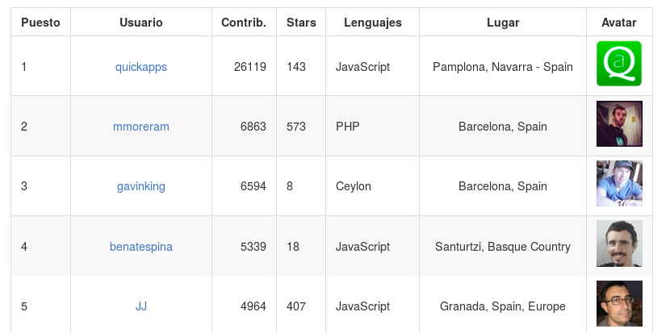

```{r, echo=FALSE, message=FALSE,results='hide',warning=FALSE}
date_followers <- read.csv("../data/aggregated-top-Spain-evol.csv",sep=";")
dates <- do.call("rbind",lapply(strsplit(as.character(date_followers$commitdate)," "),"[",1))
date_users <- data.frame(Date=as.Date(dates),Users=date_followers$users)

library("ggplot2")
library("ggthemes")
data <- read.csv("../data/date-followers-contrib.csv")
users <- read.csv("../data/users-month.csv")
```

## GitHub in Spain stays mainly in the plain


## It was early 2015

- We started to publish [GitHub rankings per province](https://github.com/JJ/top-github-users-data/blob/master/formatted/top-alt-Spain.md)
- It uses [GitHub API + scraping for getting per-user info](https://github.com/JJ/github-city-rankings).
- Why Spain?


## The number of users kept increasing

```{r,echo=FALSE, message=FALSE,results='hide',warning=FALSE}
ggplot(date_users,aes(x=Date,y=Users))+geom_line()+geom_point()+scale_x_date()+ theme_tufte()
```

## Happy!


## But.. whose fault is it?


## Many new users?

```{r, echo=FALSE,message=FALSE}
ggplot( data, aes(x=Yr,y=..count..))+geom_bar(stat='bin')+scale_x_continuous(breaks=c(2007:2016))+  theme_tufte()
```

###Apparently not!

## Who's coming then?

```{r, echo=FALSE,message=FALSE}
ggplot(data=users)+geom_bar(aes(x=Month,y=IncUsers,fill='Users'),alpha=.3,stat='identity')+geom_bar(aes(x=Month,y=NewUsers,fill='New Users'),stat='identity')+theme_tufte()+ theme(axis.text.x = element_text(angle = 90, hjust = 1))
```

## New users are old users!

- Most people who show up in the ranking *were already in GitHub*
- Updated profile or oldtimer reactivation?

## Who knows

-Coming up, in the next season of *GitHub users in Spain stay mainly in the plain*, **new users are the new old users**.

-But we will try to find out.

## Thanks!


